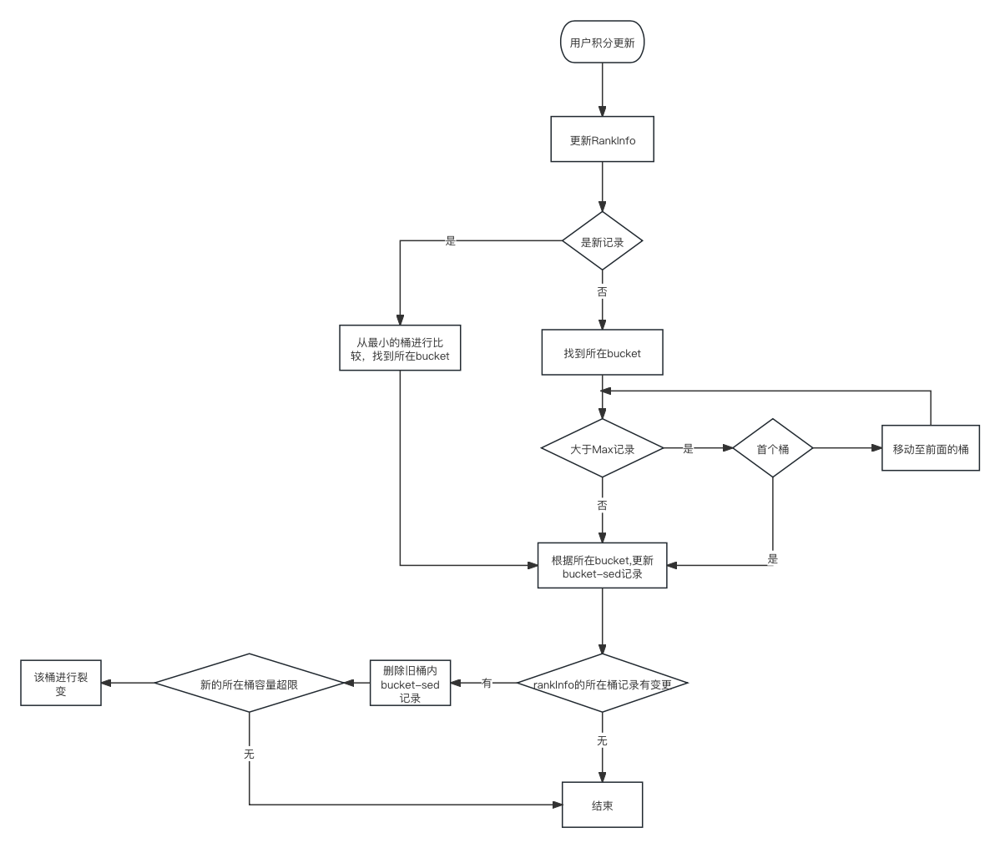

# Game-Rank

## 接口说明	

* 均为http请求，post接口
* 返回值统一格式为：{status, data, err}，当status = 1时说明请求成功data为返回值内容，否则err为错误信息

#### 更新积分

##### path

```
/api/update_score
```

##### 请求参数

| 字段名 | 类型   | 说明     |
| ------ | ------ | -------- |
| pid    | uint64 | 用户id   |
| score  | uint32 | 最新积分 |
| level  | uint32 | 用户等级 |
| name   | string | 用户昵称 |
| active | string | 活动代号 |

##### 返回值

无

#### 获取排行榜

##### path

```
/api/rank_list
```

##### 请求参数

| 字段名 | 类型   | 说明     |
| ------ | ------ | -------- |
| pid    | uint64 | 用户id   |
| active | string | 活动代号 |

##### 返回值

| 字段名   | 类型        | 说明                        |
| -------- | ----------- | --------------------------- |
| rIndex   | Int32       | 用户在列表内的索引，从0开始 |
| rankList | []CRankInfo | 排行榜列表                  |

###### CRankInfo


| 字段名   | 类型        | 说明                        |
| -------- | ----------- | --------------------------- |
| pid    | uint64 | 用户id   |
| score  | uint32 | 最新积分 |
| level  | uint32 | 用户等级 |
| name   | string | 用户昵称 |
| rank | uint32 | 用户排名 |


## 逻辑说明

主要分为两大部分

* 活动过程中，玩家积分在不断增加，服务提供通过”分桶“的形式进行存储玩家的积分相关信息
* 活动结束后，提供玩家进行查询自己积分排名情况

### 积分更新存储

活动积分相关数据使用mongo进行存储，主要涉及一下几种集合

* ActiveRank: 对应代码中`src/entry/rank_bucket.go`中的ActiveRank结构，用于保存当前各个桶的基本信息，其中`buckets`数组是从大到小有序排列，一个活动只有一条该记录
* RankInfo: 对应代码中`src/entry/rank_info.go`中的RankInfo结构，用于保存用户的积分相关详细信息，该集合需要进行分片存储
* Bucket-{n}: 对应代码中`src/entry/rank_info.go`中的BucketSed结构，根据排名规则，保存用户排名系数信息

#### 比较”积分“的大小

参与比较大小的参数包括积分、更新时间、等级、昵称。这些信息在每次更新时，保存在RankInfo内。在BucketSed中的sed字段是这些参数构建而来，规则如下:

```
"(score + 100000)(timestamp)(level+10000)(name)"
```

他们拼接成字符串以后，通过字符序进行比较大小

#### 玩家的排名

玩家的排名通过桶排名和桶内排名计算得来。在ActiveBucket中记录了每个桶的基本信息，其中包括：

* 桶内存在多少记录
* 桶内最大记录
* 桶内最小记录

同时buckets数组是从大到小排列的，那么玩家排名如下计算

* 玩家所在桶前面有n个桶，累加n个桶的记录数为bRank
* 玩家在桶的排名为iRank
* 玩家全局排名为bRank + iRank

#### 积分更新



* 积分更新以后，根据”大小“规则，和所在桶的最大值进行比较(积分只能是增加了)，如果依然小于最大值，则还在桶内，如果大于最大值，可能会移动到前面的桶内
* 只有玩家记录所对应的桶不是第一个桶时，才会向前移动
* 当由于新增加记录或者记录移动导致单个桶的容量超过预设上限时，将该桶内前30%的记录拆分出来，单独创建一个桶(新集合)，该集合在buckets中位于旧桶的前面

最终，积分记录会分散到不同的桶内(集合)

### 获取积分排名

* 根据桶排名和桶内排名，计算获得玩家的排名
* 在桶内获取玩家左右20条记录，如果不足20条并且存在相邻桶，则在相邻桶内补充
* 根据玩家的全局排名，计算其他记录的全局排名
* 最终将该玩家的排名请求结果缓存在redis内，供下次请求使用

## 设计说明

* 主要思路是将大量待排序的记录，拆分成小集合，让计算排名时处于一个可控延迟范围内
* 拆分行为是在积分更新的过程中自动拆分的，没有采用积分分段的形式进行预拆分是考虑的记录最终会很不均匀
* 操作mongo延迟在可接受范围内的情况下计算积分排名列表，并做redis缓存
* 积分更新操作是在锁下进行

## 优化方向

* 要让桶最终更均匀：积分不断更新后，会存在”冷“桶和”小“桶，可以将这样的桶预左右合适的桶进行合并，让最终的桶更均匀
* 拉取排名列表时，索然是小集合，但是也有一定的计算量，可以考虑将单次计算排名列表的左右范围扩大到50(目前是左右20)，将它看做是一个group，进行缓存，其他相邻玩家可以再次利用它生成自己的排名列表缓存。相当于增加了一个大列表缓存，来降低延迟与mongo的压力。
* 安全：积分更新操作如果中断，需要增加桶修复机制


